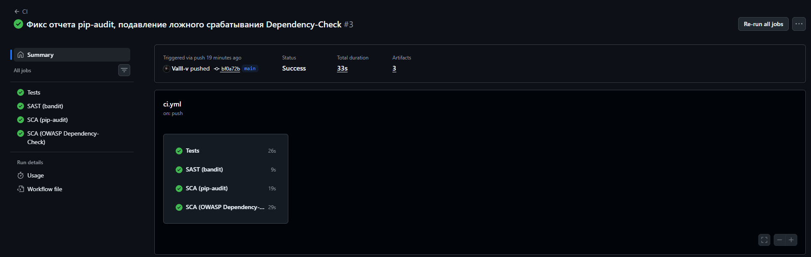
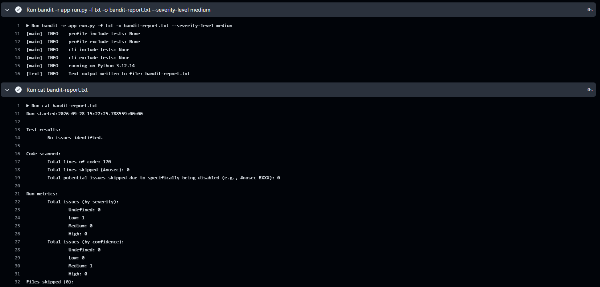
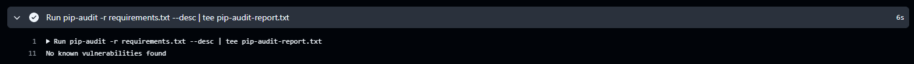

# Лабораторная работа 1. Разработка защищенного REST API с интеграцией в CI/CD

Дисциплина: Информационная безопасность

## Описание проекта

Небольшой REST API на Python/Flask с аутентификацией по JWT. Данные хранятся в SQLite через SQLAlchemy.
В репозитории настроен GitHub Actions pipeline, который на каждый push и pull request запускает тесты,
статический анализ кода (bandit) и проверку зависимостей на известные уязвимости (pip-audit, OWASP Dependency-Check).

Стек:
- Python 3.12+, Flask 3
- Flask-SQLAlchemy (SQLite)
- PyJWT - выдача и проверка JWT
- bcrypt - хэширование паролей
- pytest, bandit, pip-audit

Структура:

```
app/
  __init__.py   - создание приложения, обработчики ошибок, заголовки безопасности, тестовые данные
  config.py     - конфигурация (секреты берутся из переменных окружения)
  models.py     - модели User и Post
  security.py   - хэширование паролей, JWT, middleware проверки токена
  auth.py       - POST /auth/login
  api.py        - GET /api/data, GET /api/me
tests/          - тесты pytest
.github/workflows/ci.yml - pipeline
run.py          - запуск сервера
```

## Запуск

```bash
python -m venv .venv
.venv\Scripts\activate        # Windows
# source .venv/bin/activate   # Linux/macOS
pip install -r requirements-dev.txt

set JWT_SECRET=какой-нибудь-длинный-секрет   # Linux: export JWT_SECRET=...
python run.py
```

Сервер поднимается на `http://127.0.0.1:5000`. При первом запуске создается файл `instance/app.db`
и в него добавляются тестовые пользователи и посты.

Если `JWT_SECRET` не задан, секрет генерируется случайно при каждом запуске (токены перестают
работать после перезапуска сервера). Для учебного примера это нормально, в проде так делать нельзя.

Тестовые учетные записи:

| Логин | Пароль   |
|-------|----------|
| admin | admin123 |
| user  | user123  |

Тесты:

```bash
pytest -v
```

## Описание API

| Метод | Путь          | Аутентификация | Описание                                     |
|-------|---------------|----------------|----------------------------------------------|
| POST  | /auth/login   | нет            | Принимает логин и пароль, возвращает JWT     |
| GET   | /api/data     | Bearer JWT     | Список постов                                |
| GET   | /api/me       | Bearer JWT     | Информация о текущем пользователе из токена  |

### POST /auth/login

Запрос:

```bash
curl -X POST http://127.0.0.1:5000/auth/login \
  -H "Content-Type: application/json" \
  -d '{"username":"admin","password":"admin123"}'
```

Ответ `200`:

```json
{
  "access_token": "eyJhbGciOiJIUzI1NiIsInR5cCI6IkpXVCJ9...",
  "expires_in": 3600,
  "token_type": "Bearer"
}
```

При неверном логине или пароле - `401 {"error": "invalid credentials"}` (ответ одинаковый в обоих случаях,
чтобы нельзя было перебором узнать, какие логины существуют). Если тело не JSON или поля не строки - `400`.

### GET /api/data

Без токена:

```bash
curl -i http://127.0.0.1:5000/api/data
```

```
HTTP/1.1 401 UNAUTHORIZED
{"error": "authorization required"}
```

С токеном:

```bash
curl http://127.0.0.1:5000/api/data -H "Authorization: Bearer <token>"
```

```json
{
  "count": 3,
  "data": [
    {"author": "admin", "body": "Привет, это тестовый пост.", "id": 1, "title": "Первый пост"},
    {"author": "user", "body": "Не храните пароли в открытом виде!", "id": 2, "title": "Про безопасность"},
    {"author": "user", "body": "&lt;img src=x onerror=alert(1)&gt;", "id": 3, "title": "&lt;script&gt;alert(&#39;xss&#39;)&lt;/script&gt;"}
  ]
}
```

Третий пост специально содержит XSS-пейлоад, чтобы было видно, что он экранируется.

Просроченный токен - `401 {"error": "token expired"}`, поддельный - `401 {"error": "invalid token"}`.

### GET /api/me

```bash
curl http://127.0.0.1:5000/api/me -H "Authorization: Bearer <token>"
```

```json
{"id": 1, "posts_count": 1, "username": "admin"}
```

## Реализованные меры защиты

### Защита от SQL-инъекций (A03:2021 Injection)

Все обращения к базе идут через ORM SQLAlchemy, сырых SQL-запросов и конкатенации строк в коде нет.
Например, поиск пользователя при логине (`app/auth.py`):

```python
user = User.query.filter_by(username=username).first()
```

ORM превращает это в параметризованный запрос, значение `username` передается отдельно от текста запроса,
поэтому строка вроде `admin' OR '1'='1' --` просто не найдет пользователя. Это проверяется в тесте
`test_login_sqli_attempt`.

Дополнительно на входе проверяется, что логин и пароль - строки и что их длина ограничена.

### Защита от XSS (A03:2021 Injection)

Все пользовательские данные, которые возвращаются в ответах (`title`, `body`, `author`, `username`),
экранируются функцией `markupsafe.escape()` (`app/api.py`):

```python
"title": str(escape(p.title)),
"body": str(escape(p.body)),
```

Символы `<`, `>`, `"`, `'`, `&` заменяются на HTML-сущности, так что даже если фронтенд вставит ответ в
страницу через `innerHTML`, скрипт не выполнится.

Кроме этого, все ответы отдаются с `Content-Type: application/json` и с заголовками
(`app/__init__.py`):

- `X-Content-Type-Options: nosniff` - браузер не будет пытаться интерпретировать JSON как HTML
- `X-Frame-Options: DENY` - защита от clickjacking
- `Content-Security-Policy: default-src 'none'` - на всякий случай, если ответ откроют напрямую в браузере

### Защита от Broken Authentication (A07:2021 Identification and Authentication Failures)

**Хэширование паролей.** Пароли хранятся только в виде bcrypt-хэша (`app/security.py`):

```python
def hash_password(password):
    return bcrypt.hashpw(password.encode("utf-8"), bcrypt.gensalt()).decode("utf-8")

def check_password(password, password_hash):
    return bcrypt.checkpw(password.encode("utf-8"), password_hash.encode("utf-8"))
```

bcrypt сам добавляет соль и специально медленный, что усложняет перебор по украденной базе.

**JWT.** После успешного логина выдается токен HS256 с полями `sub` (id пользователя), `username`,
`iat` и `exp` (по умолчанию живет 1 час). Секрет для подписи берется из переменной окружения `JWT_SECRET`.

**Middleware.** Для всех маршрутов blueprint'а `/api` перед обработчиком вызывается `require_auth()`
(`app/api.py`):

```python
@api_bp.before_request
def check_token():
    return require_auth()
```

Функция достает токен из заголовка `Authorization: Bearer <token>`, проверяет подпись и срок действия,
находит пользователя в базе и кладет его в `flask.g.current_user`. Если что-то не так - возвращает `401`
и до обработчика запрос не доходит. Таким образом, новый эндпоинт в `/api` автоматически будет защищен.

Также:
- сообщение об ошибке при логине не раскрывает, существует ли пользователь;
- ошибки 404/405/500 возвращаются в JSON без стек-трейсов;
- секреты не захардкожены, берутся из окружения.

## CI/CD

Pipeline описан в `.github/workflows/ci.yml` и запускается на каждый push и pull request. Job'ы:

| Job                          | Инструмент             | Что делает                                                              |
|------------------------------|------------------------|-------------------------------------------------------------------------|
| Tests                        | pytest                 | Прогоняет 13 тестов (логин, доступ без токена, XSS, SQLi, хэширование)  |
| SAST (bandit)                | bandit                 | Статический анализ кода `app/` и `run.py`, падает при Medium/High        |
| SCA (pip-audit)              | pip-audit              | Проверяет зависимости из `requirements.txt` по базе PyPI Advisory / OSV  |
| SCA (OWASP Dependency-Check) | OWASP Dependency-Check | Дополнительная проверка зависимостей по NVD, падает при CVSS >= 7       |

Отчеты bandit, pip-audit и Dependency-Check сохраняются как artifacts запуска.

Job с Dependency-Check помечен `continue-on-error`, потому что без ключа NVD API загрузка базы иногда
падает по лимитам. Основная проверка зависимостей - pip-audit, ей ключи не нужны.

При первом запуске Dependency-Check нашел CVE-2025-45770 (CVSS 7.0) у PyJWT 2.15.0. Разбор показал, что
это ложное срабатывание: сканер сопоставил пакет с CPE `jwt_project:jwt`, а эта CVE относится к
PHP-библиотеке lcobucci/jwt и к тому же оспорена ее мейнтейнерами. pip-audit по PyJWT ничего не находит.
Срабатывание подавлено через `dependency-check-suppressions.xml` с пояснением, почему оно ложное, -
так принято делать вместо отключения проверки целиком.

bandit в текущем коде находит одно замечание уровня Low (B105, строка `"token_type": "Bearer"` -
он считает ее захардкоженным паролем). Это ложное срабатывание, в pipeline порог выставлен на Medium.

Локально те же проверки:

```bash
bandit -r app run.py
pip-audit -r requirements.txt
```

### Скриншоты

Общий вид pipeline:



Отчет bandit:



Отчет pip-audit:



### Ссылка на последний успешный запуск pipeline

TODO
